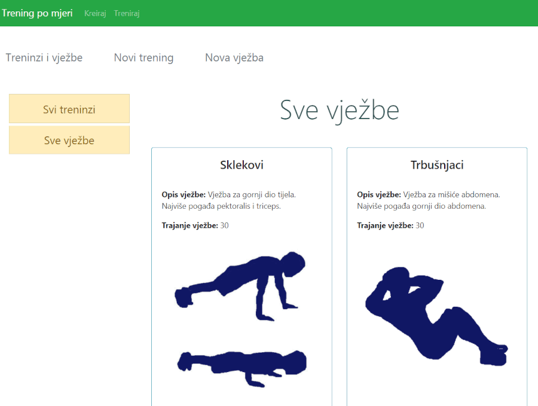
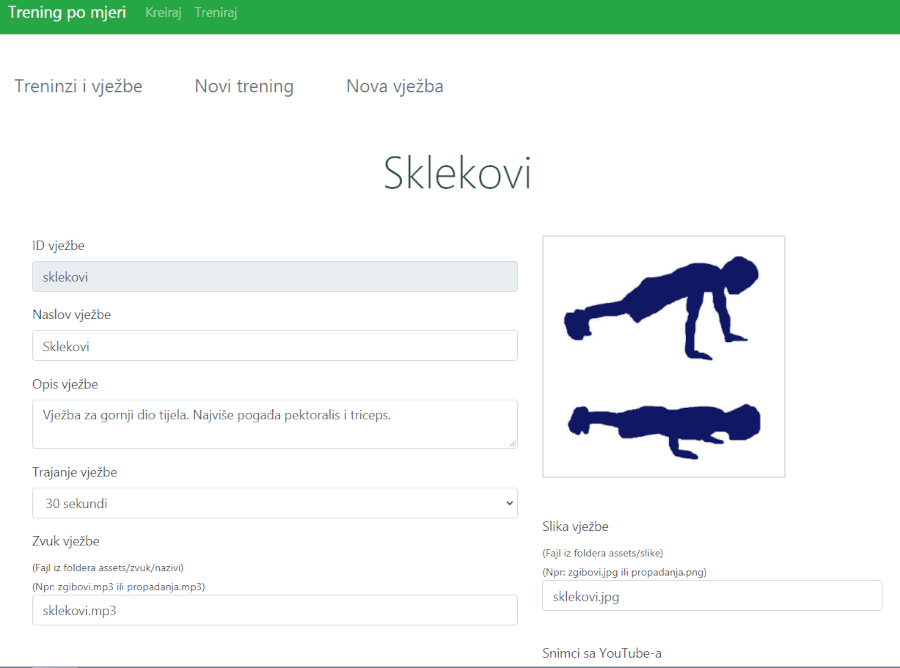
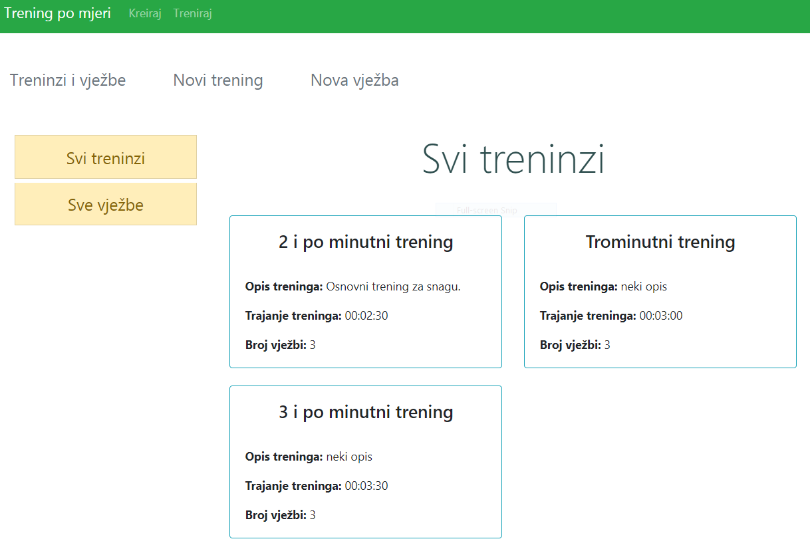
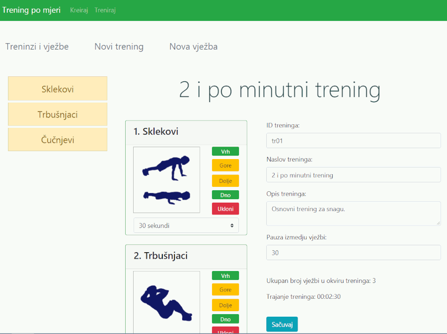
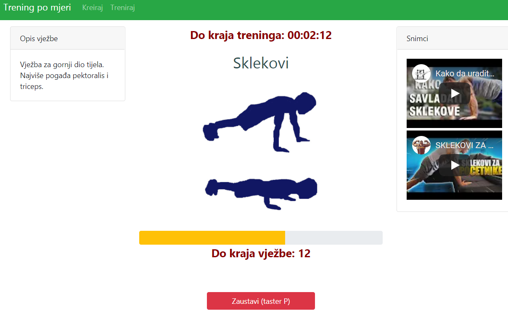

# PersonalniTrener

## *Kreiranje, izmjena i brisanje vježbe. Kreiranje i izmjena treninga, i kontrola toka treninga.*

Module - za organizaciju koda \
Child routing sa lazy loadingom (bez lazy loadinga mi nije radilo) \
Lazy loading (modul se ucitava, tek kad postoji potreba; suprotno od SPA, gdje se svi moduli odmah ucitavaju)

Niz providers, u modulu (bice ucitano samo kad se pristupi svojstvu kreator-treninga. NE moze mu se pristupiti iz ostalih modula.) \
Metoda splice, za manipulaciju nizom - dodavanje elementa, uklanjanje, premjestanje. \
Route guards - Resolve. \
ngModelGroup - grupisanje elemenata forme u jedan objekat. \
Forme - Template-driven i Reactive

